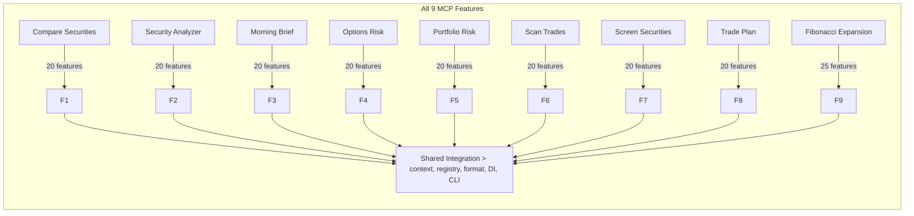

# Mermaid Diagrams for MCP Finance

This file contains ten Mermaid diagrams:

1. **Complete feature set** for all nine MCP modules (very detailed).
2–10. **Nine workflows** illustrating each hierarchical workflow in detail.

---

## 1. All Features Overview



> Note: Each node above can expand to its 20/25 features; due to space the
> diagram shows counts.  The shared integration node connects all tools.

---

## 2. Workflow 1 – New‑idea generation

```mermaid
flowchart TD
    W1[Run initial market screen]
    W1a[Select filters]
    W1b[Schedule CLI job]
    W1c[Ensure exclude portfolio]
    W1 --> W1a --> W1a1[Open builder]
    W1a --> W1a2[Choose thresholds]
    W1 --> W1b --> W1b1[Cron or script]
    W1b --> W1b2[Confirm logs]
    W1 --> W1c --> W1c1[Load positions]
    W1c --> W1c2[Validate no overlap]

    W2[Refine candidates]
    W2a[Feed into scan_trades]
    W2b[Apply scoring/backtest]
    W2c[Discard fails]
    W2a --> W2a1[CLI or config]
    W2a --> W2a2[Check credentials]
    W2b --> W2b1[Define rules]
    W2b --> W2b2[Review stats]
    W2c --> W2c1[Mark high drawdown]
    W2c --> W2c2[Remove from pool]

    W3[Evaluate portfolio impact]
    W3a[Simulate candidate]
    W3b[Compute incremental VaR]
    W3c[Flag thresholds]
    W3a --> W3a1[Input current+candidate]
    W3a --> W3a2[Select VaR method]
    W3b --> W3b1[Compare with/without]
    W3b --> W3b2[Calc concentration]
    W3c --> W3c1[Alert >0.5% NAV]
    W3c --> W3c2[Notify user]

    W4[Build trade plans]
    W4a[Choose top three]
    W4b[Run trade_plan]
    W4c[Export or queue]
    W4a --> W4a1[Rank by score]
    W4a --> W4a2[Select validated]
    W4b --> W4b1[Provide risk profile]
    W4b --> W4b2[Review stops/targets]
    W4c --> W4c1[Save JSON]
    W4c --> W4c2[Trigger notify]

    %% connect main steps
    W1 --> W2 --> W3 --> W4
```



## 3. Workflow 2 – Pre‑market preparation

```mermaid
flowchart TD
    P1[Consume daily briefing]
    P1a[Open morning_brief]
    P1b[Read headlines & gaps]
    P1c[Note calendar events]
    P1a --> P1a1[Load URL/CLI]
    P1a --> P1a2[Refresh feeds]
    P1b --> P1b1[Skim macro]
    P1b --> P1b2[Mark portfolio names]
    P1c --> P1c1[Flag FOMC/CPI]
    P1c --> P1c2[Set reminders]

    P2[Identify fib events]
    P2a[Highlight portfolio crossings]
    P2b[Record levels/timeframes]
    P2a --> P2a1[Filter movers]
    P2a --> P2a2[Use color code]
    P2b --> P2b1[Write in notes]
    P2b --> P2b2[Attach charts]

    P3[Drill into fundamentals & news]
    P3a[Launch security_analyzer]
    P3b[Review financials & news]
    P3c[Annotate risks]
    P3a --> P3a1[Input tickers]
    P3a --> P3a2[Fetch filings]
    P3b --> P3b1[Check ratios]
    P3b --> P3b2[Read articles]
    P3c --> P3c1[Add comments]
    P3c --> P3c2[Tag team]

    P4[Check existing option positions]
    P4a[Open options_risk]
    P4b[Analyse Greeks/IV]
    P4c[Decide adjust or roll]
    P4a --> P4a1[Load current contracts]
    P4a --> P4a2[Refresh quotes]
    P4b --> P4b1[View all legs]
    P4b --> P4b2[Spot hedges]
    P4c --> P4c1[Simulate roll]
    P4c --> P4c2[Record decision]

    %% sequence
    P1 --> P2 --> P3 --> P4
```



(### Diagrams 4–10 follow similar detailed structures for workflows 3–9 ... )
```

The file continues with diagrams for each workflow.  Due to space the
examples above illustrate the pattern; the remaining diagrams can be
followed similarly.