# Detailed Mermaid Diagrams for Workflows 3–5

This document contains expanded Mermaid flowcharts for workflows 3, 4 and
5.  Each diagram includes the ten additional elements introduced in the
`WORKFLOWS_3_5_DETAILED.md` file, providing a very granular visual
representation.

---

## Workflow 3 – Earnings play (detailed)

```mermaid
flowchart TD
    B1[Benchmark peer performance]
    B1a[Select peer list]
    B1b[Choose time windows]
    B1c[Pull comparative charts]
    B1d[Calc avg EPS surprise]
    B1e[Identify momentum outliers]
    B1f[Check peer IV percentile]
    B1g[Download data CSV]
    B1h[Flag peers with upcoming earnings]
    B1i[Visualise sector map]
    B1j[Store results in DB]

    B2[Generate AI narrative]
    B2a[Launch analyzer ticker+earnings]
    B2b[Wait for summary & sentiment]
    B2c[Request surprise breakdown]
    B2d[Ask for analyst comments]
    B2e[Fetch past price moves]
    B2f[Save narrative note]
    B2g[Append unusual items]
    B2h[Tag with date/version]
    B2i[Send snippet to Slack]
    B2j[Link to trade plan]

    B3[Locate price zones]
    B3a[Compute fib 50/100/200]
    B3b[Overlay on charts]
    B3c[Mark past earnings reaction levels]
    B3d[Note pivots/MAs overlap]
    B3e[Store zones with confidence]
    B3f[Colour-code by strength]
    B3g[Publish to Sheets]
    B3h[Add alert triggers]
    B3i[Compare vs peers]
    B3j[Recalc after price gap]

    B4[Check option skew]
    B4a[Query chain with options filters]
    B4b[Compute put/call ratio]
    B4c[Identify high OI strikes]
    B4d[Calc expected move]
    B4e[Plot skew curve]
    B4f[Compare to history]
    B4g[Search unusual volume]
    B4h[Evaluate protection cost]
    B4i[Add top 3 to watchlist]
    B4j[Document IV crush risk]

    B5[Formulate trade plan]
    B5a[Set entry, target, stop, horizon]
    B5b[Choose risk profile]
    B5c[Model w/ w/o options]
    B5d[Calculate Greeks]
    B5e[Compute PoP]
    B5f[Generate PnL chart & VaR]
    B5g[Export JSON to OMS]
    B5h[Set automated alerts]
    B5i[Schedule post‑earnings review]
    B5j[Tag "earnings" & link notes]

    B1 --> B2 --> B3 --> B4 --> B5
```

## Workflow 4 – Risk audit (detailed)

```mermaid
flowchart TD
    C1[Compute stress metrics]
    C1a[Select snapshot & scenarios]
    C1b[Run VaR methods]
    C1c[Apply sector shocks]
    C1d[Generate scenario charts]
    C1e[Produce PDF report]
    C1f[Store in compliance folder]
    C1g[Email compliance/Slack]
    C1h[Log timestamp/user]
    C1i[Archive for quarterly audit]
    C1j[Tag with reason]

    C2[Benchmark against peers]
    C2a[Identify peer portfolio/index]
    C2b[Pull same metrics]
    C2c[Compare VaR/CVaR/concentration]
    C2d[Highlight deviations]
    C2e[Side-by-side colour table]
    C2f[Check peer hedge strategies]
    C2g[Note over/under-exposures]
    C2h[Save results in notebook]
    C2i[Flag structural differences]
    C2j[Use for rebalancing decisions]

    C3[Screen for hedge opportunities]
    C3a[Run scan_trades for inverse/defensive]
    C3b[Filter by liquidity/cost]
    C3c[Score by VaR reduction]
    C3d[Rank hedges cost-benefit]
    C3e[Visualise correlation matrix]
    C3f[Check options as hedges]
    C3g[Shortlist preferred hedges]
    C3h[Document selection rationale]
    C3i[Determine notional required]
    C3j[Add hedges to provisional plan]

    C4[Draft revised trade plan]
    C4a[Create plan with hedges/trims]
    C4b[Input new exposures/stops]
    C4c[Generate PnL & risk metrics]
    C4d[Validate VaR within limits]
    C4e[Determine execution schedule]
    C4f[Export to OMS/manual review]
    C4g[Set execution alerts]
    C4h[Run follow-up risk audit]
    C4i[Record audit comments]
    C4j[Archive final plan version]

    C1 --> C2 --> C3 --> C4
```



## Workflow 5 – Momentum rotation (detailed)

```mermaid
flowchart TD
    D1[Screen for momentum]
    D1a[Define momentum criteria]
    D1b[Include volume/ATR filters]
    D1c[Run scan & export CSV]
    D1d[Compute percentile ranks]
    D1e[Tag by sector]
    D1f[Filter out illiquid names]
    D1g[Save list with timestamp]
    D1h[Schedule next run]
    D1i[Email top 10 movers]
    D1j[Archive scan parameters]

    D2[Compare to current holdings]
    D2a[Use compare_securities with portfolio]
    D2b[Pull momentum/volatility/distance]
    D2c[Identify stronger momentum names]
    D2d[Exclude existing holdings]
    D2e[Compute turnover cost]
    D2f[Visualise sector overlap]
    D2g[Flag earnings/events soon]
    D2h[Export to Google Sheets]
    D2i[Add explanatory notes]
    D2j[Store shortlist for review]

    D3[Compute technical entries]
    D3a[Calculate fib levels for each]
    D3b[Determine swing entry/exit]
    D3c[Overlay MAs & pivots]
    D3d[Identify confluence zones]
    D3e[Record strength scores]
    D3f[Set entry alerts]
    D3g[Draw multi-entry scenarios]
    D3h[Compare across timeframes]
    D3i[Create chart snapshots]
    D3j[Save analysis to database]

    D4[Verify fundamentals]
    D4a[Pull financial statements]
    D4b[Compute key ratios]
    D4c[Check analyst rating changes]
    D4d[Scan news for negatives]
    D4e[Remove weak-candidates]
    D4f[Document removal reasons]
    D4g[Rate fundamentals 1-5]
    D4h[Attach AI summaries]
    D4i[Save checks with metadata]
    D4j[Aggregate ratings to shortlist]

    D5[Risk-check before buying]
    D5a[Input hypothetical positions]
    D5b[Choose position sizes]
    D5c[Observe VaR/drawdown]
    D5d[Ensure limits not exceeded]
    D5e[Adjust sizes if needed]
    D5f[Calc worst-case loss]
    D5g[Flag unacceptable risk spikes]
    D5h[Export annotated risk report]
    D5i[Send to inner-circle for opinion]
    D5j[Finalise or defer execution plan]

    D1 --> D2 --> D3 --> D4 --> D5
```



---

Each of the three diagrams above includes the full set of twenty primary,
secondary and tertiary steps.  They can be rendered using a Mermaid
generator or the VS Code Mermaid preview.
