# Detailed Mermaid Diagrams for Workflows 6–9

This document contains expanded Mermaid flowcharts for workflows 6, 7, 8 and
9. Each diagram includes the ten additional elements introduced in the
`WORKFLOWS_3_5_DETAILED.md` file, providing a very granular visual
representation.

---

## Workflow 6 – Long‑term thesis validation (detailed)

```mermaid
flowchart TD
    E1[Review macro environment]
    E1a[Read monthly morning_brief]
    E1b[Extract GDP/inflation quotes]
    E1c[Note regulatory/geopolitical events]
    E1d[Flag events for holdings]
    E1e[Copy data to notebook]
    E1f[Mark items needing follow-up]
    E1g[Set calendar reminders]
    E1h[Send summary to strategy team]
    E1i[Archive brief for later]
    E1j[Link to risk dashboard]

    E2[Re‑analyse fundamentals]
    E2a[Run security_analyzer quarterly update]
    E2b[Review revenue/earnings trend]
    E2c[Check debt & cashflow ratios]
    E2d[Identify management changes]
    E2e[Fetch latest analyst forecasts]
    E2f[Compare to previous analysis]
    E2g[Save updated ratios]
    E2h[Annotate negative/positive triggers]
    E2i[Send alert if metrics worsen]
    E2j[Link analysis to thesis document]

    E3[Peer comparison]
    E3a[Select sector leaders in compare_securities]
    E3b[Run valuation, growth, momentum metrics]
    E3c[Identify quartile placement]
    E3d[Generate difference report]
    E3e[Highlight peers outperforming]
    E3f[Note any peers with similar risk]
    E3g[Save peer report PDF]
    E3h[Discuss in weekly meeting]
    E3i[Tag any peer threats]
    E3j[Update thesis doc with peer insights]

    E4[Technical alignment]
    E4a[Recalculate fib levels for holdings]
    E4b[Determine if price above key support]
    E4c[Identify new breakdowns or breakouts]
    E4d[Set alerts on critical level breaches]
    E4e[Review moving average positioning]
    E4f[Note divergence from peers]
    E4g[Create annotated charts]
    E4h[Save charts to repository]
    E4i[Prepare exit plan if invalidated]
    E4j[Notify trading desk of potential actions]

    E5[Update risk posture]
    E5a[Recalculate portfolio_risk with new data]
    E5b[Observe shifts in VaR, beta, concentration]
    E5c[Simulate hypothetical reallocations]
    E5d[Decide on rebalance or trim]
    E5e[Compute expected impact of rebalance]
    E5f[Generate report for compliance]
    E5g[Schedule rebalance orders if needed]
    E5h[Archive risk update]
    E5i[Notify stakeholders of changes]
    E5j[Link risk file to thesis document]

    E1 --> E2 --> E3 --> E4 --> E5
```

## Workflow 7 – Options hedge construction (detailed)

```mermaid
flowchart TD
    F1[Find volatile position]
    F1a[Sort holdings by volatility score]
    F1b[Identify those >30% vol]
    F1c[Rank by notional size]
    F1d[Create candidate list]
    F1e[Check upcoming events for those names]
    F1f[Estimate potential downside exposure]
    F1g[Mark high-priority hedges]
    F1h[Discuss with risk manager]
    F1i[Log candidates in tracking sheet]
    F1j[Prepare for options analysis]

    F2[Survey option chains]
    F2a[Pull current chains via options_risk]
    F2b[Compute IV and OI for each strike]
    F2c[Calculate cost per delta unit]
    F2d[Filter out low-liquidity strikes]
    F2e[Note major expirations coming]
    F2f[Plot IV term structure]
    F2g[Identify skew irregularities]
    F2h[Save top candidate strikes]
    F2i[Estimate order sizes required]
    F2j[Export chain to spreadsheet]

    F3[Select fib‑based strikes]
    F3a[Compute fib levels from history]
    F3b[Overlay levels on option chain view]
    F3c[Choose strike just below support]
    F3d[Ensure strike liquidity]
    F3e[Calculate cost vs protection ratio]
    F3f[Check alignment with expected move]
    F3g[Note multiple candidate strikes]
    F3h[Tag each with confidence score]
    F3i[Compare to previous similar hedges]
    F3j[Save chosen strike details]

    F4[Assess hedge impact]
    F4a[Input hedge into portfolio_risk simulation]
    F4b[Observe change in total VaR]
    F4c[Check effect on concentration and beta]
    F4d[Run sensitivity to price moves]
    F4e[Estimate hedge cost vs risk reduction]
    F4f[Decide if cost justifies benefit]
    F4g[Try alternative hedge structures if not]
    F4h[Document final choice and reasoning]
    F4i[Get approval if necessary]
    F4j[Prepare order instructions]

    F5[Record hedge plan]
    F5a[Enter details into trade_plan]
    F5b[Specify entry, size, expiration]
    F5c[Set alerts for underlying approaching strike]
    F5d[Link to risk assessment report]
    F5e[Assign plan owner/responsible party]
    F5f[Schedule review post-earnings/event]
    F5g[Save plan version for audit]
    F5h[Notify desk to implement]
    F5i[Track fill progress]
    F5j[Post-execution, rerun risk audit]

    F1 --> F2 --> F3 --> F4 --> F5
```

## Workflow 8 – Research session (detailed)

```mermaid
flowchart TD
    G1[Bulk calculate levels]
    G1a[Provide watchlist symbols]
    G1b[Choose timeframes to compute]
    G1c[Run CLI job]
    G1d[Cache results in DB]
    G1e[Tag data timestamp/source]
    G1f[Verify calculations finished]
    G1g[Notify team of availability]
    G1h[Store raw output files]
    G1i[Backup results]
    G1j[Prepare for step 2]

    G2[Execute options-aware scan]
    G2a[Launch scan_trades with options filters]
    G2b[Require tradable options availability]
    G2c[Set IV rank/skew criteria]
    G2d[Run pattern detection module]
    G2e[Flag unusual IV moves]
    G2f[Export candidate list]
    G2g[Score candidates by risk/reward]
    G2h[Save scan parameters]
    G2i[Send results to Slack channel]
    G2j[Archive results]

    G3[Deep symbol analysis]
    G3a[Run security_analyzer on shortlist]
    G3b[Fetch full fundamentals, news]
    G3c[Retrieve analyst ratings & targets]
    G3d[Pull AI-generated summaries]
    G3e[Compile into one-page summary]
    G3f[Highlight catalysts/risks]
    G3g[Save notes to research DB]
    G3h[Share summary with collaborators]
    G3i[Request feedback/comments]
    G3j[Revise summary based on input]

    G4[Prototype trade plans]
    G4a[Feed picks into trade_plan with hypotheticals]
    G4b[Input assumed entry & time horizon]
    G4c[Allow plan to size & set stops]
    G4d[Backtest plan historically]
    G4e[Compute expected return & PoP]
    G4f[Plot PnL distribution]
    G4g[Compare multiple plan variants]
    G4h[Save best prototype]
    G4i[Share prototype for review]
    G4j[Tag prototype as research-only]

    G5[Summarise in mini-brief]
    G5a[Generate short morning_brief-style summary]
    G5b[Include top 3 ideas and rationale]
    G5c[Format for email/Slack distribution]
    G5d[Attach charts & plan exports]
    G5e[Send to research group]
    G5f[Solicit feedback or approval]
    G5g[Update summary with any responses]
    G5h[Archive final brief]
    G5i[Track any resulting trades]
    G5j[Link brief to research database]

    G1 --> G2 --> G3 --> G4 --> G5
```

## Workflow 9 – End‑of‑day review (detailed)

```mermaid
flowchart TD
    H1[Recap the day]
    H1a[Read evening morning_brief archive]
    H1b[Check after-hours news updates]
    H1c[List tickers moved >3%]
    H1d[Record reasons if available]
    H1e[Note macro developments]
    H1f[Copy summary to journal]
    H1g[Share recap with team]
    H1h[Save archive link]
    H1i[Tag noteworthy names]
    H1j[Prepare for next morning]

    H2[Update risk figures]
    H2a[Recompute daily portfolio_risk metrics]
    H2b[Save output with date tag]
    H2c[Compare to morning values]
    H2d[Highlight drift in VaR/concentration]
    H2e[Investigate sources of change]
    H2f[Note intraday events causing drift]
    H2g[Log any anomalies]
    H2h[Export risk report]
    H2i[Send to stakeholders]
    H2j[Archive risk update]

    H3[Review open plans]
    H3a[Check trade_plan items triggered/filled]
    H3b[Mark executed plans with fill prices]
    H3c[Cancel or adjust incomplete plans]
    H3d[Tag successes or failures]
    H3e[Store outcomes in performance DB]
    H3f[Analyse reasons for misses]
    H3g[Plan improvements for next iteration]
    H3h[Send summary to trading desk]
    H3i[Archive plan outcomes]
    H3j[Link outcomes to research notes]

    H4[Gather sentiment summaries]
    H4a[Ask security_analyzer for sentiment on movers]
    H4b[Submit tickers and request report]
    H4c[Wait for analysis to complete]
    H4d[Save sentiment alongside price moves]
    H4e[Keyword-tag positive/negative sentiment]
    H4f[Use data for pattern research]
    H4g[Incorporate sentiment into next morning brief]
    H4h[Share findings with team]
    H4i[Archive sentiment results]
    H4j[Reference in future strategy meetings]

    H1 --> H2 --> H3 --> H4
```

---

Each of the four diagrams above contains the full set of primary,
secondary and tertiary steps plus the ten extra elements per workflow. They
are ready to render via Mermaid.